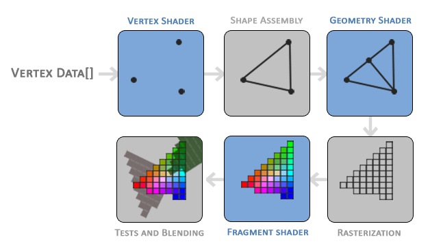
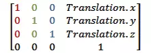
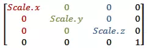
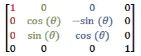
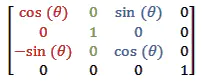
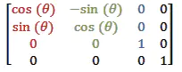

顶点着色器
---
经过之前的学习，大家对OpenGL的渲染流程有了一个大概的了解。那么，我们先来看一张经典的流程图：  

从图中可以看到，整个流程的第一步便是顶点着色器。

## 一个简单的顶点着色器程序
顶点着色器顾名思义，它的作用就是对图形的顶点数据进行处理，下面是一段最简单的顶点着色器程序：
```
precision mediump float;
attribute vec4 a_Position;
void main() {
    gl_Position = a_Position;
}
```
 
第一行声明了着色器使用中等精度（precision:精确、精度 ）  
第二行声明了一个vec4属性的变量a_Position  
第三行main为入口函数  
第四行将a_Position直接赋值给gl_Position  
第五行函数结束  

### 须知
* 顶点着色器程序并不是只执行一次，有多少个点便要执行多少次，一次只处理一个顶点。（与之呼应的是片段着色器，有多少个像素便执行多少次）
* attribute表明这个变量是系列变量，每次执行都会改变，这里对应着每一个顶点（与之相对的是uniform，每次执行都是同一个值）
* vec4表示这是一个四维变量（其它还有vec2二维变量），对应一个顶点的xyzw，xyz表示其空间坐标，默认为0，w表示其归一化，默认为1。
* gl_Position是顶点着色器的一个内置变量，表示着色器的输出。

### 顶点坐标系统
在手机屏幕或者原生View中，其原点（0,0）是左上角，x轴和y轴分别向右和向下延伸，没有z轴。其可视区域是是手机屏幕的大小或者View的大小。  
而在openGL中，坐标范围是可以设置的，其默认范围为[-1,1]  
```
//设置坐标范围
gl?.glFrustumf(-1f, 1f, -1f, 1f, -5f, 5f)
```

为了对openGL的坐标系统有一个更全面认识，我们需要知道几个比较重要的坐标系统：
* 物体空间
即某个图形（三角形、正方体、物体模型、人物模型）对于自己空间的坐标

* 世界空间
图形在相对于外部的坐标，在一个大的场景中，各个模型所处的位置及方向

* 观察空间
在场景中，我们摄像机所观察的位置及方向

* 裁剪空间
摄像机所观察的景深及范围

* 屏幕空间
相机所观察到的视图，映射到屏幕上

*小问题：刚刚我们设置的坐标范围是什么空间的坐标范围？*

### 坐标变换*

首先，定义一个简单的正三角形：
```
var triangleCoords = floatArrayOf(     // in counterclockwise order:
        0.0f, 0.622008459f, 0.0f,      // top
        -0.5f, -0.311004243f, 0.0f,    // bottom left
        0.5f, -0.311004243f, 0.0f      // bottom right
)
```
然后我们给它一个世界坐标：
```
//世界坐标
val worldPosition = floatArrayOf(
    0.2f, 0.2f, 0f, 1f
)
```
重新编写顶点着色器：
```
precision mediump float;
attribute vec4 a_Position;
uniform vec4 world_Position;
void main() {
    gl_Position = vec4(
       vPosition.x * world_Position.w + world_Position.x,
       vPosition.y * world_Position.w + world_Position.y,
       vPosition.z * world_Position.w + world_Position.z,
       vPosition.w)
}
```
这样，就把一个三角形放入了世界空间中（这里只设置了它的位置和大小，并没有设置其方向）

在正常开发中，我们都使用矩阵进行变换计算：
```
//平移矩阵
val translateMatrix  = floatArrayOf(
    1.0f, 0.0f, 0.0f, x,
    0.0f, 1.0f, 0.0f, y,
    0.0f, 0.0f, 1.0f, z,
    0.0f, 0.0f, 0.0f, 1.0f
)
//缩放矩阵
val scaleMatrix   = floatArrayOf(
    w, 0.0f, 0.0f, 0.0f,
    0.0f, w, 0.0f, 0.0f,
    0.0f, 0.0f, w, 0.0f,
    0.0f, 0.0f, 0.0f, 1.0f
)
```
* 平移矩阵  

* 缩放矩阵

* x轴旋转矩阵

* y轴旋转矩阵

* z轴旋转矩阵


顶点坐标变换我们点到为止，更多的矩阵变换和相机视图让我们期待超键的《视图窗口操作》，这里我们需要知道的是顶点着色器可以进行顶点坐标变换。  

### 着色器变量关联

上面我们知道了如何在顶点着色器中对坐标进行变换，那么我们如何将顶点数据赋值到对应的变量中呢？

*以下以Android API 29下的opengl GLES30为例*  
对顶点着色器的“vPosition”变量进行赋值：
```
        // 获取 mProgram 程序中 类型为attribute 的 "vPosition" 变量 （的指针）
        // 注意：变量名须于自己编写的程序对应
        positionHandle = GLES30.glGetAttribLocation(mProgram, "vPosition").also {

            // 使能顶点数据 使GPU能够读取到顶点数据
            GLES30.glEnableVertexAttribArray(it)

            // 加载顶点数据
            GLES30.glVertexAttribPointer(
                it,
                COORDS_PER_VERTEX,
                GLES30.GL_FLOAT,
                false,
                COORDS_PER_VERTEX * 4,
                vertexBuffer
            )
            // 绘制三角形
            GLES30.glDrawArrays(GLES30.GL_TRIANGLES, 0, vertexCount)

            // 去使能顶点数据
            GLES30.glDisableVertexAttribArray(it)

//            函数原型：
//            void glVertexAttribPointer (int index, int size, int type, boolean normalized, int stride, Buffer ptr )
//            参数含义：
//            index  指定要修改的顶点着色器中顶点变量id；
//            size   指定每个顶点属性的组件数量。必须为1、2、3或者4。如position是由3个（x,y,z）组成，而颜色是4个（r,g,b,a））；
//            type   指定数组中每个组件的数据类型。可用的符号常量有GL_BYTE, GL_UNSIGNED_BYTE, GL_SHORT,GL_UNSIGNED_SHORT, GL_FIXED, 和 GL_FLOAT，初始值为GL_FLOAT；
//            normalized  指定当被访问时，固定点数据值是否应该被归一化（GL_TRUE）或者直接转换为固定点值（GL_FALSE）；
//            stride      指定连续顶点属性之间的偏移量。如果为0，那么顶点属性会被理解为：它们是紧密排列在一起的。初始值为0。如果normalized被设置为GL_TRUE，意味着整数型的值会被映射至区间[-1,1](有符号整数)，或者区间[0,1]（无符号整数），反之，这些值会被直接转换为浮点值而不进行归一化处理；
//            ptr  顶点的缓冲数据。
        }
```

对uniform 型变量“world_Position”进行赋值：
```
            // 获取 mProgram 程序中 类型为uniform 的 "world_Position" 变量 （的指针）
            // 注意：变量名须于自己编写的程序对应
            GLES30.glGetUniformLocation(mProgram, "world_Position").also {

                GLES30.glUniform4fv(it, 1, worldPosition, 0)

//                函数原型：
//                void glUniform4fv(GLint location,  GLsizei count, const GLfloat *value );
//                location：变量指针
//                count：要修改的数量
//                value：数组
//                offset：数组偏移
//                glUniform 修改类型为Uniform的变量；4 4个一组的属性；f 浮点型；v 指针型
            }
```

**函数glUniform**

* 注意：  
由于OpenGL ES由C语言编写，但是C语言不支持函数的重载，所以会有很多名字相同后缀不同的函数版本存在。其中函数名中包含数字（1、2、3、4）表示接受这个数字个用于更改uniform变量的值，i表示32位整形，f表示32位浮点型，ub表示8位无符号byte，ui表示32位无符号整形，v表示接受相应的指针类型。

函数原型：
```
void glUniform1f(GLint location,  GLfloat v0); 

void glUniform2f(GLint location,  GLfloat v0,  GLfloat v1); 

void glUniform1i(GLint location,  GLint v0); 

void glUniform2i(GLint location,  GLint v0,  GLint v1); 

void glUniform1fv ( GLint location, GLsizei count, const GLfloat *v );

void glUniform2fv ( GLint location, GLsizei count, const GLfloat *v );

void glUniform3fv ( GLint location, GLsizei count, const GLfloat *v );

void glUniform4fv ( GLint location, GLsizei count, const GLfloat *v );
//......
```

**函数glVertexAttribPointer与glVertexAttrib**
```
void glVertexAttribPointer ( GLuint indx, GLint size, GLenum type, GLboolean normalized, GLsizei stride, GLint offset ) 

void glVertexAttribPointer ( GLuint indx, GLint size, GLenum type, GLboolean normalized, GLsizei stride, const GLvoid *ptr )

void glVertexAttrib4fv ( GLuint indx, const GLfloat *values )

//......
```

**矩阵设置函数glUniformMatrix**
在着色器中定义矩阵：
```
uniform mat4 uMVPMatrix;
```
赋值函数：
```
void glUniformMatrix4fv ( GLint location, GLsizei count, GLboolean transpose, const GLfloat *value )
//......
```

### END